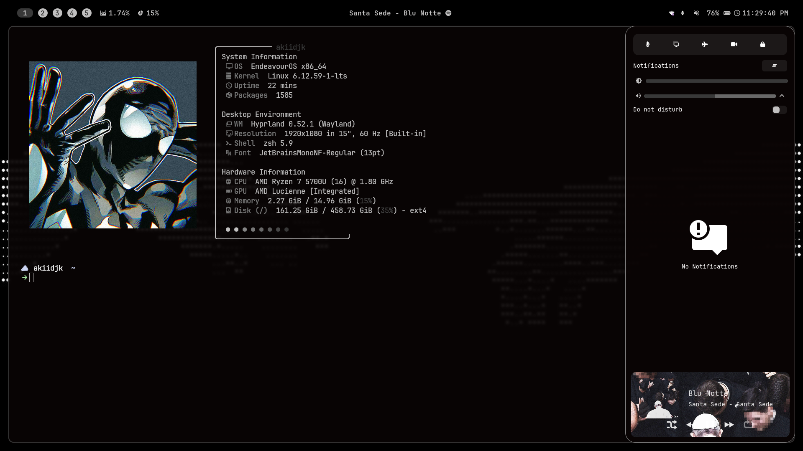
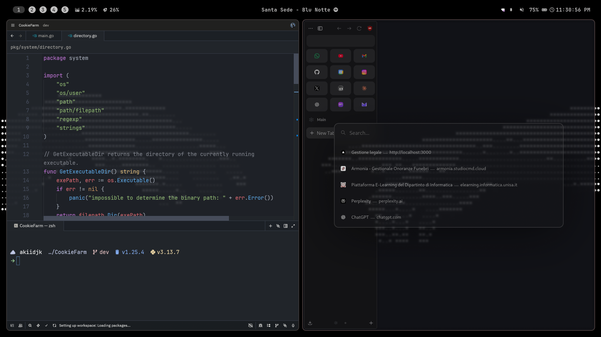
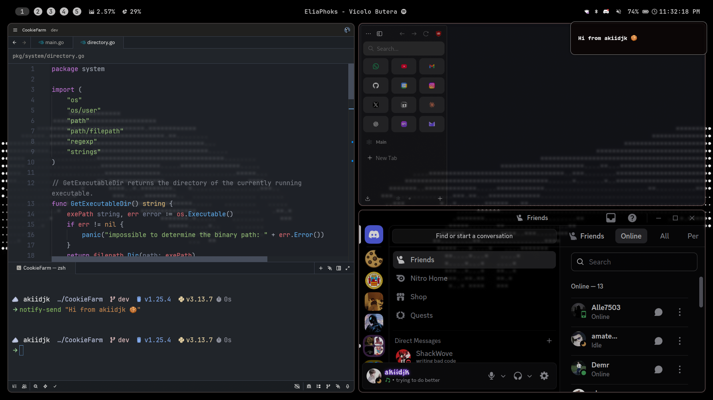
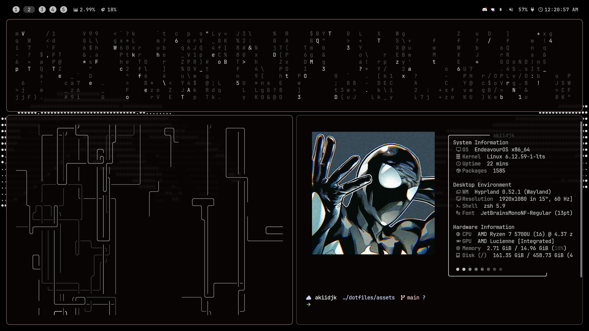
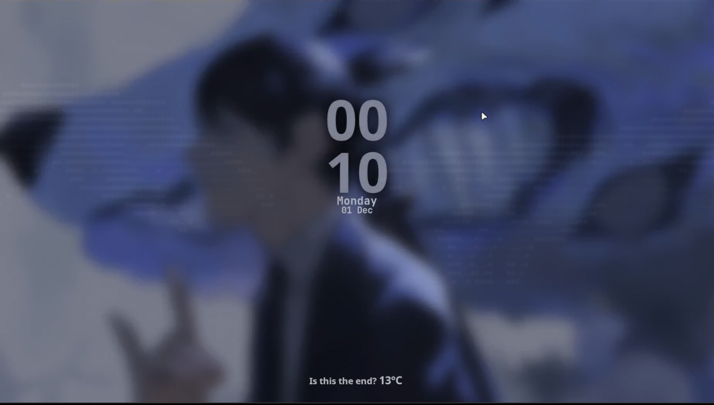

# Dotfiles
Personal Dotfiles Configuration

## Overview
This repository contains my personal configuration files for Hyprland and various applications on Arch Linux.

## Showcase

[Video showcase](https://youtu.be/PYrdxSZ8US0)







## Dependencies

> [!Warning]
>
> I haven’t verified that every dependency is listed and i have not tested for now this on a clean distro, so some may still be missing.
> Also note that some packages may have additional dependencies that need to be installed separately.
> Please refer to the official documentation of each package for more details.
> This setup is tailored for Arch Linux; adjustments may be needed for other distributions.
> Some packages are installed via AUR, so ensure you have an AUR helper like `yay` installed.
> This setup assumes you have basic knowledge of Linux command line and package management.
> Make sure to back up your existing configuration files before applying these dotfiles.

### Hyprland Installation
For a complete Hyprland setup, you can use JaKooLit's script:
```bash
git clone --depth=1 https://github.com/JaKooLit/Arch-Hyprland.git
cd Arch-Hyprland
chmod +x install.sh
./install.sh
```

### Core System
```bash
# Update system first
sudo pacman -Syu

# Install Hyprland and core dependencies
sudo pacman -S hyprland hyprpaper hypridle hyprlock hyprshade xdg-desktop-portal-hyprland

# Display and graphics
sudo pacman -S wl-clipboard wl-clip-persist cliphist grim slurp swappy

# Audio
sudo pacman -S pipewire pipewire-pulse pipewire-alsa wireplumber pavucontrol

# Notifications
sudo pacman -S swaync libnotify

# Terminal and shell
sudo pacman -S kitty starship tmux

# File managers and utilities
sudo pacman -S nautilus yazi

# Status bar
sudo pacman -S waybar

# Text editor
sudo pacman -S vim neovim zed

# Color management
sudo pacman -S python-pywal

# Browser
yay -S zen-browser

# Other utilities
sudo pacman -S fastfetch brightnessctl playerctl pamixer wofi fzf ripgrep
```

### AUR Packages
```bash
# Install yay (AUR helper) if not installed
sudo pacman -S --needed git base-devel
git clone https://aur.archlinux.org/yay.git
cd yay
makepkg -si
cd ..
rm -rf yay

# Install AUR packages
yay -S hyprpicker
yay -S vicinae-bin  # If using vicinae
yay -S cava  # Audio visualizer (if needed)
```

### Fonts Installation
```bash
# Install font dependencies
sudo pacman -S fontconfig

# Create fonts directory if it doesn't exist
mkdir -p ~/.local/share/fonts

# Copy custom fonts to system fonts directory
cp -r ~/.config/fonts/* ~/.local/share/fonts/

# Or install via package manager
sudo pacman -S ttf-jetbrains-mono-nerd ttf-nerd-fonts-symbols ttf-nerd-fonts-symbols-mono

# Refresh font cache
fc-cache -fv
```

## Installation

### Quick Install
```bash
# Clone the repository
git clone https://github.com/akiidjk/dotfiles.git ~/.config

# Make scripts executable
chmod +x ~/.config/hypr/scripts/*.sh
chmod +x ~/.config/hypr/scripts/wallpapers/*.sh

# Install fonts
cp -r ~/.config/fonts/* ~/.local/share/fonts/
fc-cache -fv
```

### Hyprshare Installation (Optional)
Not required, but if you are interest to bluelight filter:

```bash
hyprshade install
systemctl --user enable --now hyprshade.timer
```

### Zen Browser setup

Once installed via yay, you can set Zen Browser as your default browser:

```bash
xdg-settings set default-web-browser zen-browser.desktop
```
### Setup: 
  - import your bookmarks and settings from your previous browser.
  - customize Zen Browser settings to your preference.
  - import zen mods from .config/.zen/zen-mods-export.json


## Setup default mime apps
```bash
# PDF → Zen Browser
xdg-mime default zen.desktop application/pdf

# Images → qimgv
xdg-mime default qimgv.desktop image/jpeg
xdg-mime default qimgv.desktop image/png
xdg-mime default qimgv.desktop image/webp
xdg-mime default qimgv.desktop image/gif

# SVG → Zen Browser
xdg-mime default zen.desktop image/svg+xml

# Video → mpv
xdg-mime default mpv.desktop video/mp4
xdg-mime default mpv.desktop video/x-matroska
xdg-mime default mpv.desktop video/webm
xdg-mime default mpv.desktop video/x-msvideo

# Audio → mpv
xdg-mime default mpv.desktop audio/mpeg
xdg-mime default mpv.desktop audio/mp3
xdg-mime default mpv.desktop audio/wav
xdg-mime default mpv.desktop audio/flac
xdg-mime default mpv.desktop audio/ogg
xdg-mime default mpv.desktop audio/aac
xdg-mime default mpv.desktop audio/x-m4a
xdg-mime default mpv.desktop audio/webm

# Source code (generic) → Zed
xdg-mime default zed.desktop text/x-source
xdg-mime default zed.desktop text/x-script

# Common programming languages → Zed
xdg-mime default zed.desktop text/x-python
xdg-mime default zed.desktop text/x-c
xdg-mime default zed.desktop text/x-csrc
xdg-mime default zed.desktop text/x-chdr
xdg-mime default zed.desktop text/x-c++
xdg-mime default zed.desktop text/x-c++src
xdg-mime default zed.desktop text/x-java
xdg-mime default zed.desktop text/x-go
xdg-mime default zed.desktop text/x-rustsrc
xdg-mime default zed.desktop text/x-php
xdg-mime default zed.desktop text/x-shellscript
xdg-mime default zed.desktop application/javascript
xdg-mime default zed.desktop text/javascript
xdg-mime default zed.desktop text/css
xdg-mime default zed.desktop text/html
```

## Alias Reference (`.zshrc`)

This section explains the custom shell aliases defined in [`.zshrc`](./dotfiles/.zshrc). These aliases are designed to speed up common tasks and improve your terminal workflow.

| Alias           | Command / Description                                                                                   |
|-----------------|-------------------------------------------------------------------------------------------------------|
| `ls`            | `eza --icons` — List files with icons (replacement for `ls`)                                          |
| `ll`            | `eza -al --icons` — List all files (including hidden) in long format with icons                       |
| `ltr`           | `eza -a --tree --level=1 --icons` — Tree view of files/folders, one level deep, with icons            |
| `c`             | `clear` — Clear the terminal                                                                          |
| `cat`           | `bat` — Show file contents with syntax highlighting and paging (replacement for `cat`)                |
| `activate`      | `source ~/.venv/bin/activate` — Activate Python virtual environment                                   |
| `vimage`        | `kitty +kitten icat` — Display images directly in Kitty terminal                                      |
| `cpu`           | `auto-cpufreq --stats` — Show CPU frequency and stats                                                 |
| `docker-start`  | `sudo systemctl start docker.service` — Start Docker daemon                                           |
| `docker-stop`   | `sudo systemctl stop docker.service` — Stop Docker daemon                                             |
| `docker-status` | `sudo systemctl status docker.service` — Show Docker service status                                   |
| `start-vpn`     | `sudo openvpn --config <path_to_config> --auth-user-pass <path_to_creds>` — Start VPN connection      |
| `stop-vpn`      | `sudo killall openvpn` — Stop all OpenVPN processes                                                   |
| `upgradesys`    | `~/WorkSpace/Utils/scripts/upgrade_sys.sh` — Run system upgrade script                                |
| `cleansys`      | `~/WorkSpace/Utils/scripts/clean.sh` — Run system cleanup script                                      |
| `webtemplate`   | `python3 ~/WorkSpace/Utils/scripts/webtemplate/main.py` — Generate a web project template             |
| `webup`         | `python3 -m http.server 6969` — Start a local web server on port 6969                                 |
| `pymain`        | Create a Python `main.py` template with a main function                                               |

See [`.zshrc`](./dotfiles/.zshrc) for the full list and details.

## Some utility scripts I use in my configuration

This repository includes several utility scripts and shell aliases to make daily tasks easier and more efficient. Most scripts are located in `~/scripts/` or `~/.config/hypr/scripts/`.

### Aliases

Here are some useful aliases defined in my shell configuration:

| Alias         | Command                                                                                                                         | Description                                               |
|---------------|---------------------------------------------------------------------------------------------------------------------------------|-----------------------------------------------------------|
| upgradesys    | `~/scripts/upgrade_sys.sh`                                                                                                      | Upgrade the system packages                               |
| cleansys      | `~/scripts/clean.sh`                                                                                                            | Clean unnecessary files from the system                   |
| webtemplate   | `python3 ~/scripts/webtemplate/main.py`                                                                                         | Generate a basic web template                             |
| togglemirror  | `~/scripts/toggle_mirror.sh`                                                                                                    | Toggle display mirror                                     |
| webup         | `python3 -m http.server 6969`                                                                                                   | Start a simple web server on port 6969                    |
| pymain        | `echo -e "\n\ndef main():\n    pass\n\nif __name__ == \"__main__\":\n    main()" > main.py`                                    | Create a basic Python main function template in main.py   |
| mp4ToMov      | `~/scripts/mp4ToMov.sh`                                                                                                         | Convert MP4 files to MOV format                           |
| movToMp4      | `~/scripts/movToMp4.sh`                                                                                                         | Convert MOV files to MP4 format                           |

## Configuration Structure

- **swaync/** - Notification daemon and notification center configuration
- **fastfetch/** - System information tool config
- **fonts/** - Custom Nerd Fonts (JetBrains Mono, Iosevka, etc.)
- **hypr/** - Hyprland window manager configuration
  - `hyprland.conf` - Main config file
  - `keybinds.conf` - Keyboard shortcuts
  - `animations.conf` - Animation settings
  - `monitors.conf` - Monitor configuration
  - `scripts/` - Utility scripts
- **kitty/** - Terminal emulator configuration
- **nvim/** - Neovim configuration with Lazy.vim
- **starship.toml** - Shell prompt configuration
- **tmux/** - Terminal multiplexer config
- **vicinae/** - Window management tool config
- **wal/** - Pywal color scheme templates
- **waybar/** - Status bar configuration
- **yazi/** - Terminal file manager config
- **zed/** - Zed editor configuration

> [!Warning]
> 
> The Neovim (`nvim/`) configuration is currently **broken** and may not work as expected.

## Post-Installation

### Start Hyprland
```bash
# From TTY
Hyprland

# Or enable display manager
sudo systemctl enable sddm
sudo systemctl start sddm
```

## Keybindings

### Applications & Scripts
| Keybind | Action |
|---------|--------|
| `SUPER + RETURN` | Open terminal (kitty) |
| `SUPER + SPACE` | Open launcher (vicinae) |
| `SUPER + E` | Open file manager (nautilus) |
| `ALT + L` | Lock screen (hyprlock) |
| `SUPER + R` | Reload Waybar |
| `SUPER + W` | Set wallpaper + color schema |
| `SUPER + SHIFT + C` | Open color picker (hyprpicker) |
| `SUPER + SHIFT + S` | Screenshot area (grim + slurp + swappy) |
| `SUPER + K` | Hide waybar |
| `SUPER + N` | Show notification center |

### Media Controls
| Keybind | Action |
|---------|--------|
| `CTRL + SHIFT + A` | Play/Pause media |
| `CTRL + SHIFT + D` | Next track |
| `CTRL + SHIFT + S` | Previous track |

### Window Management
| Keybind | Action |
|---------|--------|
| `SUPER + Q` | Close active window |
| `SUPER + F` | Fullscreen (keep bar visible) |
| `SUPER + SHIFT + F` | Fullscreen (hide everything) |
| `SUPER + T` | Toggle floating mode |
| `SUPER + J` | Toggle split direction |
| `SUPER + Arrow Keys` | Move focus between windows |
| `SUPER + SHIFT + Arrow Keys` | Resize active window |

### Workspace Management
| Keybind | Action |
|---------|--------|
| `SUPER + [1-9,0]` | Switch to workspace 1-10 |
| `SUPER + SHIFT + [1-9,0]` | Move window to workspace 1-10 |
| `SUPER + TAB` | Switch to previous workspace |
| `SUPER + ALT + Left/Right` | Switch to prev/next workspace |
| `SUPER + Left/Right` | Switch to prev/next workspace |

### Mouse Actions
| Keybind | Action |
|---------|--------|
| `SUPER + LMB (drag)` | Move window |
| `SUPER + RMB (drag)` | Resize window |

### System Controls (Laptop)
| Keybind | Action |
|---------|--------|
| `XF86AudioRaiseVolume` | Increase volume by 5% |
| `XF86AudioLowerVolume` | Decrease volume by 5% |
| `XF86AudioMute` | Toggle mute |
| `XF86AudioMicMute` | Toggle microphone mute |
| `XF86MonBrightnessUp` | Increase brightness by 30% |
| `XF86MonBrightnessDown` | Decrease brightness by 30% |

For the complete keybinding configuration, see `~/.config/hypr/keybinds.conf`

## Resources

- **Hyprland Installation**: https://github.com/JaKooLit/Arch-Hyprland.git
- **Nerd Fonts**: https://www.nerdfonts.com/
- **Hyprland Wiki**: https://wiki.hyprland.org/
- **Arch Wiki**: https://wiki.archlinux.org/

## Credits

Based on various dotfile configurations and customized for personal use.

- [JaKooLit - Arch Hyprland Installer](https://github.com/JaKooLit/Arch-Hyprland)
- [Invincible-Dots by mkhmtolzhas](https://github.com/mkhmtolzhas/Invincible-Dots)
- [dots by 1amSimp1e (Hyprland section)](https://github.com/1amSimp1e/dots?tab=readme-ov-file#hypr)
- [SDDM theme](https://github.com/Keyitdev/sddm-astronaut-theme)

## License

Feel free to use and modify as needed (btw tag me, i want to see the edits).
